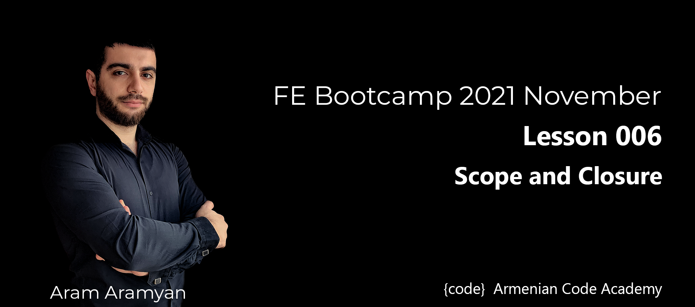

---

***1 Create a function that implements partial sum.***\
[1_createFunc.js](1_createFunc.js)
___

***2 Write a function redundant that takes in a string str and returns a function that returns str.***\
[2_redundantFunc.js](2_redundantFunc.js)
___

***3 Write a function that returns an anonymous function, which transforms its input by adding a
particular suffix at the end.***\
[3_anonymousFunc.js](3_anonymousFunc.js)
___
***4 Create a function printAfter that calls its argument after printing hello world.***\
[4_printAfter.js](4_printAfter.js)
___
***5 Write a function that implements filtering in array.***\
[5_filteringInArr.js](5_filteringInArr.js)
___

***6 Write a function which remove elements with length <= 3.***\
[6_filterByLength.js](6_filterByLength.js)
___

***7 Given an array. Determine whether it consists only from uniques or not.***\
[7_isOnlyFromUniques.js](7_isOnlyFromUniques.js)
___

***8 Determine if a word or phrase is an isogram. An isogram (also known as a "non pattern word") is a
word or phrase without a repeating letter.***\
[8_isIsogram.js](8_isIsogram.js)
___

***9 Given an array of numbers. Find the sum of numbersʼ quadratic which are even.***\
[9_sumOfEvenNumsQuad.js](9_sumOfEvenNumsQuad.js)
___

***Check whether string is palindrome, or not.***\
[10_isPalindrome.js](10_isPalindrome.js)
___

***11 Given an array of integers, find the pair of adjacent elements that has the largest product and return
that product.***\
[11_getLargestProd.js](11_getLargestProd.js)
___